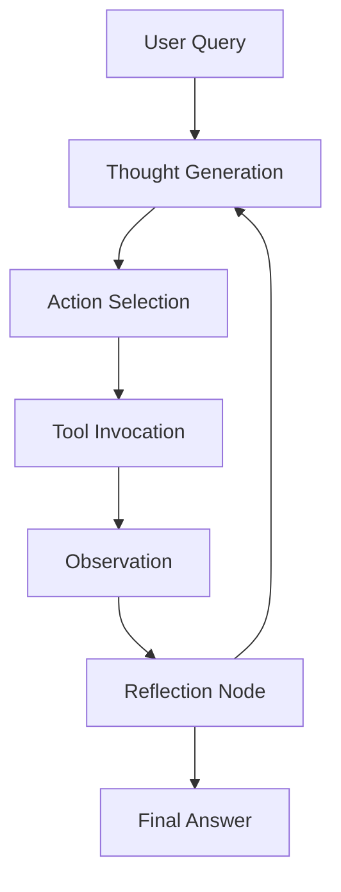

# 🧠 ReAct-Reflect-Agent-Framework

## 🎯 Purpose
Builds the foundation of **agent cognition**: how an agent reasons, acts, observes outcomes, and reflects to improve its reasoning loop.

## 🧩 Architecture

This architecture demonstrates a **cognitive feedback loop** — the agent learns from its own actions.
